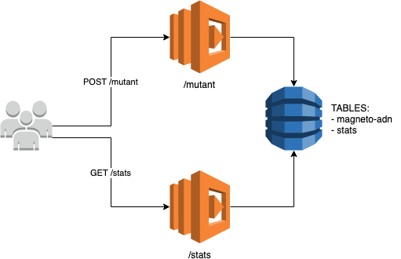

# Magneto App
La aplicación fue desarrollada en Javascript ES6 y esta en el archivo [magneto.js](src/magneto.js). En general el algoritmo interpreta la secuencia de ADN como una matriz NxN la cual es recorrida a través de sub-matrices 4x4. Por cada sub-matriz verifica la cantidad de secuencias con 4 caracteres iguales.

Existe un archivo `magneto-compiled.js` el cual esta en ES5 y fue generado utilizando Babel para poder ser utilizado en AWS Lambda.

## Arquitectura
La arquitectura de la aplicación es la siguiente:



Esta consiste en 2 lambdas, `stats` y `mutant`. `stats` es el lambda encargado de consultar los stats de todos los ADNs consultados en el tiempo, los cuales estan almacenado en la tabla `stats` en DynamoDB. `mutant` es el lambda encargado de verificar de que tipo es el ADN consultado y de actualizar la tabla `stats` con cada ADN consultado.

## Ejecución
La aplicación atualmente esta desplegada en AWS Lambdas.

### POST /mutant
El primer endpoint es para saber si un ADN es mutante o humano. La URL del lambda desplegado es la siguiente:

URL: *https://jivp8rb6pd.execute-api.us-east-1.amazonaws.com/dev/mutant*

Ejemplo de un request para un ADN humano:

```
curl --request POST \
  --url https://jivp8rb6pd.execute-api.us-east-1.amazonaws.com/dev/mutant \
  --header 'Content-Type: application/json' \
  --header 'Postman-Token: e9f192ac-6168-4d1a-a1c5-555e3d712015' \
  --header 'cache-control: no-cache' \
  --data '{ "dna": [ "ATGCGA", "CAGTGC", "TTATGT", "AGAATG", "CTCCTA", "TCACTG" ] }'
```

Ejemplo de un request para un ADN mutante:

```
curl --request POST \
  --url https://jivp8rb6pd.execute-api.us-east-1.amazonaws.com/dev/mutant \
  --header 'Content-Type: application/json' \
  --header 'Postman-Token: 0cc529a7-3e3f-49ec-9e8d-3eae865f707d' \
  --header 'cache-control: no-cache' \
  --data '{ "dna": [ "ATGCGA", "CAGTGC", "TTATGT", "AGAATG", "CCCCTA", "TCACTG" ] }'
```

Lo que hace este lambda es lo siguiente:

- Validar si el ADN es de tipo mutante o humano.
- Actualizar la tabla `stats`.
- Retornar `HTTP 200` en caso de ser mutante o `HTTP 403` en caso de ser humano.

### GET /stats
El segundo endpoint es para saber los stats de los ADN consultados en el tiempo. Para esto
se implementó otro lambda el cual esta encargado de consultar la tabla `stats` o inicilizarla 
en caso de que no existan datos previos. 

Este lambda inicializa la tabla `stats` siempre y cuando no existan datos previos en ella. En este caso,
el lambda recorre toda la tabla `magneto-adn` y calcula los stats de cada uno de los ADNs consultados.

URL: *https://jivp8rb6pd.execute-api.us-east-1.amazonaws.com/dev/stats*

Ejemplo de un request para consultar stats:

```
curl --request GET \
  --url https://jivp8rb6pd.execute-api.us-east-1.amazonaws.com/dev/stats \
  --header 'Content-Type: application/json' \
  --header 'Postman-Token: 5a77e461-f368-486f-b040-37882c5b0288' \
  --header 'cache-control: no-cache'
``` 
